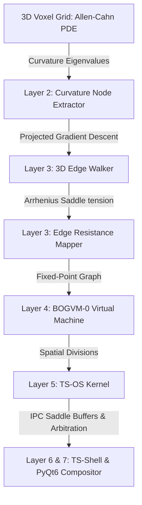

# TS-OS (Thinking System Operating System)

> **"Geometry is a symptom, not a substrate."**
> 
> A space-multiplexed, wave-state operating system and deterministic virtual machine (BOGVM-0) built entirely on continuous non-linear phase-field dynamics (Allen-Cahn PDE).

---

## 🌌 The Core Paradigm
In this operating system, discrete logic, geometric coordinates, and window boundaries are not hardcoded data structures. Instead, they are the **emergent macroscopic limits** of interacting continuous wave fields governed by non-linear dynamics. 

By injecting 6 spherical wave sources in an Octahedron arrangement, the non-linear bistable Allen-Cahn potential ($\Phi - \Phi^3$) naturally crystallizes phase cancellation boundaries into a perfect Cube (Hexahedron)—the mathematical dual of the octahedron.

---

## 🛠️ The System Architecture



### 1. The Substrate & Curvature Tensor (Layer 1 & 2)
The underlying field evolving on a $50 \times 50 \times 50$ grid follows the Allen-Cahn equation:
$$\frac{\partial \Phi}{\partial dt} = D \nabla^2 \Phi + (\Phi - \Phi^3) + \sum S_i$$
To find the emergent vertices, we calculate the $3 \times 3$ Hessian matrix:
$$H(\Phi) = \begin{pmatrix} \Phi_{xx} & \Phi_{xy} & \Phi_{xz} \\ \Phi_{xy} & \Phi_{yy} & \Phi_{yz} \\ \Phi_{xz} & \Phi_{yz} & \Phi_{zz} \end{pmatrix}$$
Solving for the eigenvalues $\lambda_1, \lambda_2, \lambda_3$ identifies local curvature peaks corresponding to the 8 Cube nodes (where $\lambda_1 \approx \lambda_2 \approx \lambda_3 < 0$).

### 2. The 3D Edge Walker & Resistance (Layer 3)
Instead of Euclidean formulas, edges are traced along saddle ridges using a **Projected Gradient Ascent** method:
$$\mathbf{v}_{\text{step}} = \text{sign}(\nabla \Phi \cdot \mathbf{e}_{\text{edge}}) \mathbf{e}_{\text{edge}}$$
As the tracer walks, it integrates the local saddle depth to calculate the gate resistance:
$$R_{ij} = 2.0 - \min(\Phi_{\text{path}})$$

### 3. BOGVM-0: Wave-State Virtual Machine (Layer 4)
Runs a 16-opcode instruction set executing purely from wave-front propagation triggers.
*   **Fixed-Point Math:** Uses a scale factor $S = 10^8$ for all floats to guarantee 100% deterministic, platform-independent integer math.
*   **Triggers:** Occurs on the rising edge of a node crossing $\ge 0.50$ energy, with a refractory period of 15 steps.
*   **Opcodes:** Evaluates the binary state ($E \ge 0.15$) of the 3 adjacent neighbors to decode instructions:
    $$\text{Opcode} = b_3 \cdot 8 + b_2 \cdot 4 + b_1 \cdot 2 + b_0 \cdot 1$$
    where $b_3$ is the trigger node's odd/even parity.

### 4. TS-OS Kernel: Space-Multiplexing & Resource Arbitration (Layer 5)
*   **Space-Multiplexing:** Voxel ownership is assigned based on a priority-weighted Voronoi distance:
    $$D_p(\mathbf{x}) = \frac{\|\mathbf{x} - \mathbf{x}_p\|}{\text{amplitude}_p}$$
*   **Saddle Tension IPC Buffer:** Boundary voxels between two processes act as shared memory segments containing local field tension values.
*   **Arbitration:** If a low-priority process's territory volume falls below 800 voxels due to high-priority expansion, the kernel suspends it by flatlining its amplitude to 0 (destructive wave interference).

### 5. TS-Shell & Compositor (Layer 6 & 7)
*   **CLI Terminal:** Allows launching, inspecting curvature, and monitoring process structures in real time.
*   **Pygame UI desktop:** Provides a frosted-glass translucent UI where process windows can be dragged (moving wave sources) and resized (rescaling wave amplitude).
*   **PyQt6 TS-DE:** A hardware-accelerated compositor that runs the Allen-Cahn engine on a daemon thread and provides a developer API ([ts_api.py](file:///home/boggersthefish/ts-verse-engine/ts_api.py)) and File Explorer.

---

## 📂 Project Structure

*   [kernel.py](file:///home/boggersthefish/ts-verse-engine/kernel.py): Substrate space partitioner, IPC manager, and rebalancer.
*   [bootloader.py](file:///home/boggersthefish/ts-verse-engine/bootloader.py): Parses `.bogpk` JSON seed packages.
*   [ts_api.py](file:///home/boggersthefish/ts-verse-engine/ts_api.py): Developer API abstraction layer.
*   [ts_os_runtime.py](file:///home/boggersthefish/ts-verse-engine/ts_os_runtime.py): Physics evolution loop and dual process boot supervisor.
*   [BOGVM-0.py](file:///home/boggersthefish/ts-verse-engine/BOGVM-0.py): Arithmetic virtual machine engine.
*   [shell.py](file:///home/boggersthefish/ts-verse-engine/shell.py): Interactive CLI shell debugger.
*   [ts_shell.py](file:///home/boggersthefish/ts-verse-engine/ts_shell.py): Pygame-based translucent desktop manager.
*   [ts_de.py](file:///home/boggersthefish/ts-verse-engine/ts_de.py): PyQt6-based multi-threaded compositor and file launcher.
*   [theme.qss](file:///home/boggersthefish/ts-verse-engine/theme.qss): CSS Stylesheet for the PyQt6 Desktop.
*   [competing_processes.bogpk](file:///home/boggersthefish/ts-verse-engine/competing_processes.bogpk): Default competing process seed configuration.

---

## 🚀 Getting Started

### Prerequisites
Setup the python environment and dependencies:
```bash
cd /home/boggersthefish/ts-verse-engine
/home/boggersthefish/venv/bin/pip install numpy matplotlib pygame PyQt6
```

### Running Tests

#### 1. Compile & Execute BOGVM-0 Addition ($13 + 10 = 23$)
```bash
/home/boggersthefish/venv/bin/python BOGVM-0.py
```

#### 2. Run OS Substrate Boot Loader & Arbitrator
```bash
/home/boggersthefish/venv/bin/python ts_os_runtime.py
```

#### 3. Start Interactive Shell
```bash
/home/boggersthefish/venv/bin/python shell.py
```
*Try commands:* `ts_status`, `ts_inspect -0.5,0.0,0.0`, `ts_spawn 4.0 0.5,0.5,0.5`, `exit`

#### 4. Launch Pygame Window Desktop
```bash
/home/boggersthefish/venv/bin/python ts_shell.py
```
*Controls:* Drag window titles to move them, drag resize corner to scale wave amplitude, press `S` to save state.

#### 5. Launch PyQt6 Compositor
```bash
# Prefix with TS_FORCE_OFFSCREEN=1 if running headlessly over SSH
/home/boggersthefish/venv/bin/python ts_de.py
```
