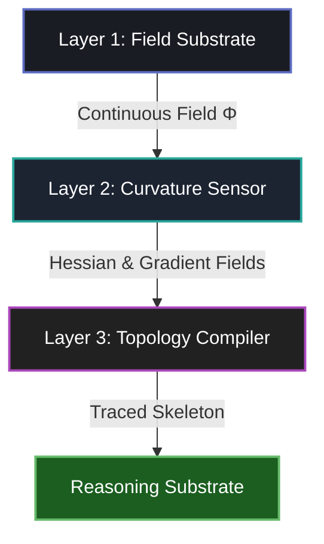

# TS-VERSE ENGINE: COGNITIVE PHYSICS COMPILER

## 1. Philosophical Paradigm: Geometry as an Emergent Symptom
In the TS-Verse Engine, we reject classical discrete Euclidean substrates (points, lines, bounding boxes, rigid geometry) as primary computational primitives. Instead, we assert that:
1. **Fields are Fundamental:** Space is filled with continuous fields $\Phi(\mathbf{x}, t)$ governed by non-linear partial differential equations (PDEs) and wave equations.
2. **Topology is the Bridge:** Discrete structures (nodes, edges, graphs) are topological singularities and gradient-flow manifolds (Morse-Smale complexes) that emerge naturally from field dynamics.
3. **Cognition is Phase Cancellation:** Geometric constraints are phase-cancellation boundaries and interference maxima of interacting wave fronts. Logical propositions correspond to stable topological configurations.

---

## 2. The 4-Layer Compiler Pipeline

Data flows strictly downwards, collapsing continuous physics into discrete logical networks.

### Layer 1: Field Substrate (Continuous Dynamics)
* **Objective:** Represent the space of potential interactions as a scalar phase field $\Phi(\mathbf{x}, t)$.
* **Wave Mechanics:** Superposition of $N$ isotropic wave sources:
  $$\Phi(\mathbf{x}, t) = \sum_{j=1}^{N_s} A_j \cos\left(k d(\mathbf{x}, \mathbf{x}_j) - \omega t + \theta_j\right)$$
  Where $d(\mathbf{x}, \mathbf{x}_j)$ is the Euclidean distance from spatial coordinate $\mathbf{x} = (x, y)$ to source $\mathbf{x}_j$.
* **PDE Dynamics (Allen-Cahn / Reaction-Diffusion):** To stabilize boundaries and self-organize ridges:
  $$\frac{\partial \Phi}{\partial t} = D \nabla^2 \Phi - f'(\Phi)$$
  Where $f(\Phi) = \frac{1}{4}(\Phi^2 - 1)^2$ is a double-well potential forcing the field to binary phases, and $D \nabla^2 \Phi$ is the isotropic diffusion term.

### Layer 2: Curvature Sensor (Tensor Diagnostics)
* **Objective:** Compute local differential geometric features of $\Phi$.
* **First Order (Gradient):**
  $$\nabla \Phi = \left( \frac{\partial \Phi}{\partial x}, \frac{\partial \Phi}{\partial y} \right)^T$$
  Magnitude $|\nabla \Phi| = \sqrt{\Phi_x^2 + \Phi_y^2}$ represents the steepness of the field.
* **Second Order (Hessian Matrix):**
  $$H(\mathbf{x}) = \nabla^2 \Phi = \begin{pmatrix} \Phi_{xx} & \Phi_{xy} \\ \Phi_{xy} & \Phi_{yy} \end{pmatrix}$$
  We solve the characteristic equation $\det(H - \lambda I) = 0$ to obtain the Hessian eigenvalues $\lambda_1, \lambda_2$ (sorted such that $\lambda_1 \le \lambda_2$):
  $$\lambda_{1, 2} = \frac{\text{Tr}(H) \pm \sqrt{\text{Tr}(H)^2 - 4 \det(H)}}{2}$$
  Where $Tr(H) = \Phi_{xx} + \Phi_{yy}$ and $\det(H) = \Phi_{xx} \Phi_{yy} - \Phi_{xy}^2$.
* **Topological Signatures:**
  * **Local Maximum (Peak):** $\lambda_1 < 0$ and $\lambda_2 < 0$.
  * **Saddle Point:** $\lambda_1 < 0 < \lambda_2$ (change in sign).
  * **Local Minimum (Valley):** $\lambda_1 > 0$ and $\lambda_2 > 0$.
  * **Ridge Line:** High gradient-directed curvature ($|\lambda_1| \gg 0$) and low transverse curvature ($\lambda_2 \approx 0$).

### Layer 3: Topology Compiler (The Extractor)
* **Objective:** Discretize the continuous field by tracing its topological skeleton using Morse Theory.
* **Node Extraction:** Nodes are the critical points of $\Phi$ where $\nabla \Phi \approx 0$ and the Hessian eigenvalues $\lambda_1, \lambda_2$ are both negative (local maxima).
* **Edge Extraction (Saddle Manifolds):**
  1. Locate saddle points (where $\nabla \Phi \approx 0$ and $\lambda_1 < 0 < \lambda_2$).
  2. The eigenvector $\mathbf{v}_2$ associated with the positive eigenvalue $\lambda_2$ defines the direction of local stability (along the ridge).
  3. Perturb slightly along $+\mathbf{v}_2$ and $-\mathbf{v}_2$ from the saddle point:
     $$\mathbf{x}_0^{\pm} = \mathbf{x}_{\text{saddle}} \pm \epsilon \mathbf{v}_2$$
  4. Perform gradient ascent (path integration) to trace the ridge lines:
     $$\frac{d\mathbf{x}}{ds} = \frac{\nabla \Phi(\mathbf{x})}{|\nabla \Phi(\mathbf{x})|}$$
  5. The integration terminates when the path converges to a local maximum (Node).
  6. The edge represents the physical saddle manifold connecting the two resulting nodes.

### Layer 4: Reasoning Substrate (The Graph)
* **Objective:** Output a strictly formatted JSON representation of the emergent graph $G = (V, E)$, making it available for symbolic reasoning.
* **Nodes ($V$):** Evaluated by coordinates, intensity ($\Phi$), and Hessian eigenvalues.
* **Edges ($E$):** Evaluated by connection source/target, average ridge field intensity (tension), and the precise coordinate sequence of the path.

---

## 3. Mathematical Absolutes
1. **No Spatial Guessing:** Under no circumstances are nodes connected by Euclidean distance or spatial search algorithms. Edges must correspond to physical gradient trajectories traced through the field.
2. **Phase Boundaries:** Phase cancellation boundaries ($\Phi(\mathbf{x}) = 0$ in opposing source fields) define the boundaries of cells, functioning as physical-geometric logic gates.
3. **Morse-Smale Decomposition:** The topology is structural and robust to perturbations.
